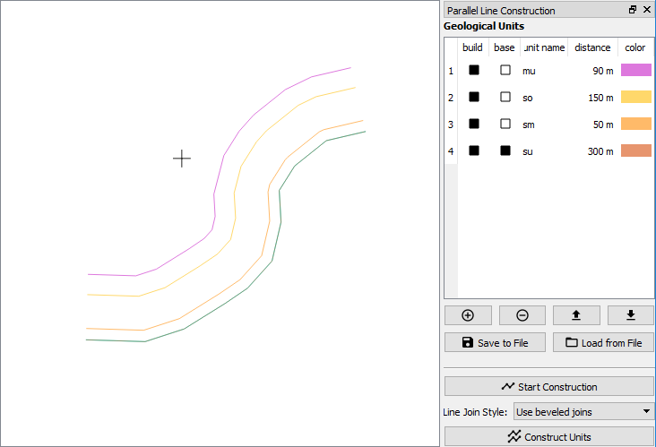
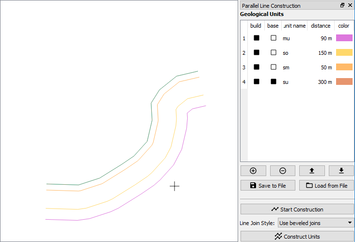

# Parallel Line Construction

**ATTENTION: This tool is currently under development and it is not ready for any productive usage!**

## General Description

This plugin constructs parallel lines based on a given baseline. It is comparable to an offset line in cad programs / tools, but can construct more than on line.

## Installation

You have to download the tool and save it into your QGIS Plugin directory. Afterwards restart QGIS and activate in it inside the *Manage and Install Plugins* dialog (*plugins* menu). For more details please take a look at [qgistutorials.com](http://www.qgistutorials.com/en/docs/using_plugins.html).

## System Requirements

This toolbox was tested with QGIS version 3.0.1.

## Usage

Select a line feature, click on "Start Construction" and select a side, where to construct the lines. An example of side selection is demonstrated with the following images:
 